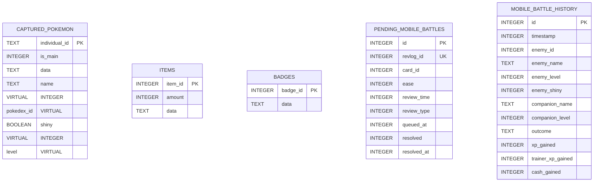

# Data Models and Schemas

This document details the in-memory domains and persistent storage structures of the Ankimon system.

---

## 1. Domain Data Models (In-Memory Objects)

### PokemonObject (`pyobj/pokemon_obj.py`)
Represents an active Pokémon in memory. It handles stat computations (Gen-III formulas), learnsets, natures, forms, and active status indicators.

| Field | Type | Description |
| :--- | :--- | :--- |
| `individual_id` | `str` (UUID) | **Primary unique identifier** distinguishing multiple instances of the same species. |
| `id` | `int` | Pokédex base species ID. |
| `name` | `str` | Display name of the Pokémon (e.g., `"Vulpix"` or `"Alolan Vulpix"`). |
| `shiny` | `bool` | Shiny variant status toggle. |
| `level` | `int` | Current experience tier of the Pokémon (1 to 100). |
| `hp` | `int` | Active battle hit points remaining. |
| `max_hp` | `int` | Maximum calculated health stat based on base stats, IVs, EVs, and level. |
| `stats` | `dict` | Computed operational stats: `hp`, `atk`, `def`, `spa`, `spd`, `spe`, `xp`. |
| `iv` / `ev` | `dict` | Individual Values (0–31) and Effort Values (0–252) for each core stat. |
| `attacks` | `list[str]` | Learnt active moves (up to 4 active battle attacks). |
| `gender` | `str` | `"M"`, `"F"`, or `"N"` (Genderless). |
| `battle_status` | `str` | Active battle condition (e.g., `"Fighting"`, `"Fainted"`, `"Paralysis"`). |
| `position` | `tuple` | Active coordinate references. |
| `tier` | `str` | Rarity category (`"Normal"`, `"Starter"`, `"Legendary"`, `"Mythical"`). |

---

## 2. Persistent Storage Schema (SQLite)

Ankimon uses a single SQLite file, `ankimon.db`, situated inside the Anki user files directory (`user_path`). All data serialization is managed by the `AnkimonDB` controller inside `pyobj/database_manager.py`.



### Table 1: `captured_pokemon`
Stores all caught specimens for the active profile deck. It replaces the legacy `mypokemon.json` and `mainpokemon.json` files.

*   **Primary Key:** `individual_id` (TEXT) - Stores the UUID generated for each Pokémon object.
*   **Is Main Flag:** `is_main` (INTEGER DEFAULT 0) - `1` if the Pokémon is the trainer's active companion, `0` otherwise.
*   **Virtual Indexing Columns:** To optimize query speeds across large collections without duplication, SQLite virtual generated columns dynamically extract properties directly from the source JSON payload:

```sql
CREATE TABLE captured_pokemon (
    individual_id TEXT PRIMARY KEY,
    is_main INTEGER DEFAULT 0,
    data TEXT NOT NULL,
    name TEXT GENERATED ALWAYS AS (json_extract(data, '$.name')) VIRTUAL,
    pokedex_id INTEGER GENERATED ALWAYS AS (json_extract(data, '$.id')) VIRTUAL,
    shiny BOOLEAN GENERATED ALWAYS AS (json_extract(data, '$.shiny')) VIRTUAL,
    level INTEGER GENERATED ALWAYS AS (json_extract(data, '$.level')) VIRTUAL
);

-- Fast Index mappings
CREATE INDEX idx_pokemon_name ON captured_pokemon(name);
CREATE INDEX idx_pokemon_pokedex_id ON captured_pokemon(pokedex_id);
CREATE INDEX idx_pokemon_shiny ON captured_pokemon(shiny);
CREATE INDEX idx_pokemon_level ON captured_pokemon(level);
```

#### The `data` JSON Schema Layout
The `data` text column holds the complete serialized dictionary of the `PokemonObject`. A sample record looks like:

```json
{
  "id": 37,
  "name": "Alolan Vulpix",
  "shiny": false,
  "level": 5,
  "ability": "Snow Cloak",
  "type": ["Ice"],
  "stats": {"hp": 38, "atk": 41, "def": 40, "spa": 50, "spd": 65, "spe": 65, "xp": 100},
  "attacks": ["Powder Snow", "Tail Whip"],
  "base_experience": 60,
  "growth_rate": "medium-fast",
  "hp": 38,
  "ev": {"hp": 0, "atk": 0, "def": 0, "spa": 0, "spd": 0, "spe": 1},
  "iv": {"hp": 15, "atk": 22, "def": 18, "spa": 30, "spd": 11, "spe": 29},
  "gender": "F",
  "battle_status": "Fighting",
  "xp": 0,
  "tier": "Normal",
  "captured_date": "2026-05-20T12:00:00Z",
  "individual_id": "8b9e6a4b-d30a-44c5-84a8-6ad37cc243bb"
}
```

### Table 2: `items`
Manages inventory supplies (Pokéballs, potions, evolutionary stones).

*   **Columns:**
    *   `item_id` (INTEGER PRIMARY KEY) - Corresponds to the PokeAPI item ID.
    *   `amount` (INTEGER) - Available inventory count.
    *   `data` (TEXT JSON) - Detailed item metadata.

### Table 3: `badges`
Tracks achievement markers and reward completions.

*   **Columns:**
    *   `badge_id` (INTEGER PRIMARY KEY) - System identification code.
    *   `data` (TEXT JSON) - Status, date earned, and associated milestones.

### Table 4: `pending_mobile_battles` (Phase 1)
Tracks review sessions synced from mobile clients that have pending battles to resolve.

*   **Columns:**
    *   `id` (INTEGER PRIMARY KEY AUTOINCREMENT) - Unique identifier for the queue.
    *   `revlog_id` (INTEGER UNIQUE) - Timestamp in milliseconds of the corresponding Anki revlog row. Uniqueness prevents duplicate battle generation.
    *   `card_id` (INTEGER) - Target card ID.
    *   `ease` (INTEGER) - Ease rating of review (1=Again, 2=Hard, 3=Good, 4=Easy).
    *   `review_time` (INTEGER) - Time spent reviewing the card in milliseconds.
    *   `review_type` (INTEGER) - Type of review (1=review, 2=relearn).
    *   `queued_at` (INTEGER) - Unix millisecond timestamp when the battle was added to the queue.
    *   `resolved` (INTEGER) - Resolution status (0=pending, 1=resolved).
    *   `resolved_at` (INTEGER) - Unix millisecond timestamp when resolved.

### Table 5: `mobile_battle_history` (Phase 2+)
Logs the outcome of resolved mobile review battles, capped at a maximum of **500** records.

*   **Columns:**
    *   `id` (INTEGER PRIMARY KEY AUTOINCREMENT) - Unique identifier for the log entry.
    *   `timestamp` (INTEGER NOT NULL) - Millisecond timestamp when the battle was simulated/resolved.
    *   `enemy_id` (INTEGER NOT NULL) - Pokédex base species ID of the opponent.
    *   `enemy_name` (TEXT NOT NULL) - Species name of the opponent.
    *   `enemy_level` (INTEGER NOT NULL) - Level of the opponent.
    *   `enemy_shiny` (INTEGER NOT NULL) - Binary indicator (`1` if shiny, `0` otherwise) of the opponent.
    *   `companion_name` (TEXT) - Name of the active companion that fought the battle.
    *   `companion_level` (INTEGER) - Level of the active companion.
    *   `outcome` (TEXT NOT NULL) - Outcome text (e.g., `"caught"`, `"defeated"`, `"lost"`, `"escaped"`).
    *   `xp_gained` (INTEGER DEFAULT 0) - Experience points awarded to the companion.
    *   `trainer_xp_gained` (INTEGER DEFAULT 0) - Experience points awarded to the trainer card.
    *   `cash_gained` (INTEGER DEFAULT 0) - Cash awarded to the trainer.

### Metadata Keys

*   `mobile_revlog_watermark` - Holds the `id` (timestamp in ms) of the most recently processed mobile review in the `revlog` collection **per DB connection**. Each `AnkimonDB` instance maintains its own watermark to prevent duplicate sync when multiple connection objects are active during hot-swap.
*   `mobile_resolved_encounters_count` - Running count of encounters that have been fully resolved (auto or manual). Written after every real resolve. Used exclusively by `_compute_encounter_idx()` as the seed offset for encounter generation — grows unboundedly and is never capped.

---

## 3. Serialization and Deserialization

`AnkimonDB` handles all conversion pipelines:
*   **Encoding:** Objects are converted into standard python dictionaries, serialized using `json.dumps(..., ensure_ascii=False)` in `_obfuscate()`, and stored inside the database text column.
*   **Decoding:** String blobs are parsed using `json.loads()` inside `_deobfuscate()`, then fed back into the `PokemonObject` constructor.

> [!IMPORTANT]
> To prevent data corruption, never write direct SQL strings against the virtual fields (`name`, `pokedex_id`, etc.). All data mutations must write directly to the `data` JSON field via python model properties and call `mw.ankimon_db.save_pokemon()`.
